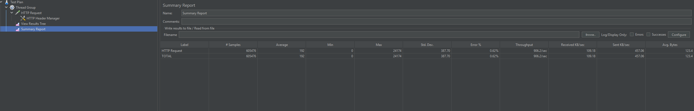
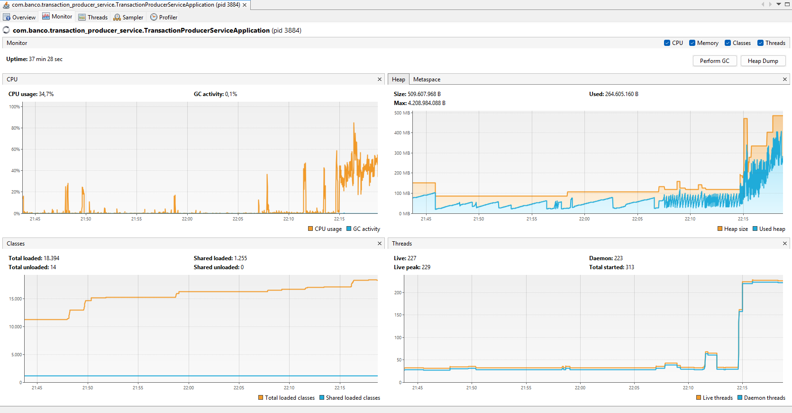
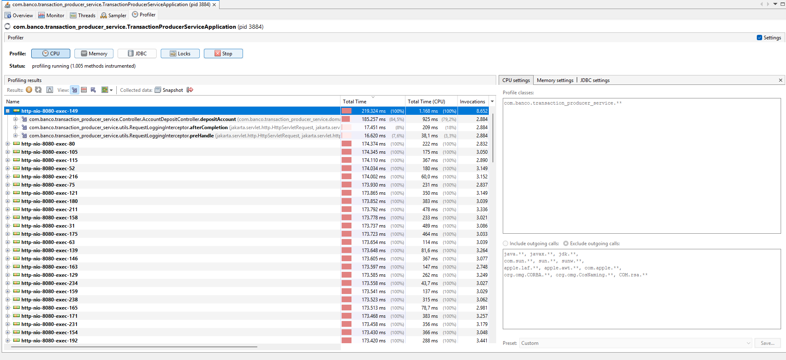
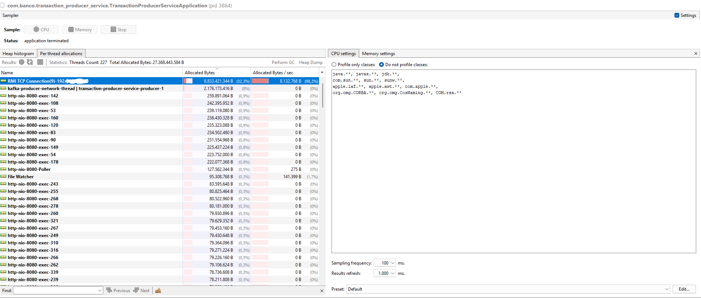
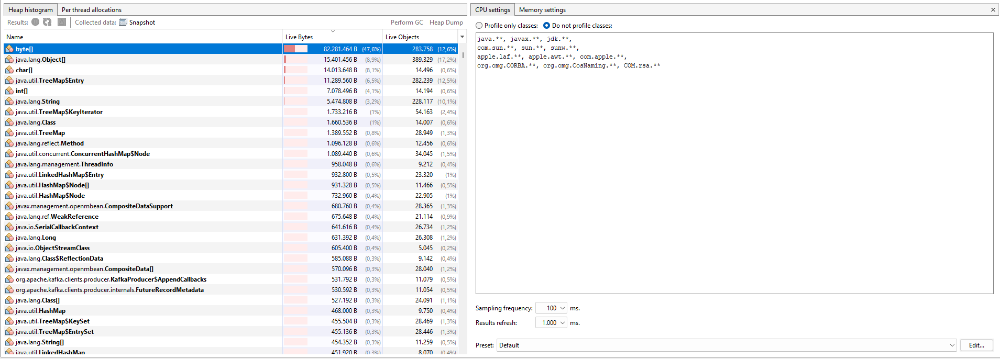

# **transaction-producer-service**
### **API Produtora de Transações**
A transaction-producer-service é uma API responsável por publicar transações financeiras, como depósitos e transferências entre contas, em um tópico Kafka. Faz parte de uma arquitetura de microserviços, permitindo que outras partes do sistema consumam as transações para processamento posterior.
Com validações robustas, a API garante que apenas dados seguros e consistentes sejam enviados para o Kafka. Utilizando o Spring Kafka, ela facilita a integração com sistemas consumidores, promovendo escalabilidade e alta performance no processamento de transações financeiras em tempo real.
## **Principais Funcionalidades**
- ✉️ **Recebimento de Transações:**
    - Recebe informações sobre depósitos ou transferência entre contas por meio de requisições HTTP.

- ✅ **Validação de Dados:**
    - Valida detalhadamente os campos da requisição usando **Jakarta Bean Validation**, garantindo que apenas informações válidas sejam publicadas.

- 📡 **Envio para Kafka:**
    - Publica mensagens das transações em um tópico Kafka configurado no sistema.

- 📜 **Logs e Monitoramento:**
    - Registra operações utilizando logs para rastreamento e monitoramento.

## **Endpoints Disponíveis**
### 1. **Depósito**
- **URL:** `/deposits`
- **Método:** `POST`
- **Descrição:** Realiza o depósito em uma conta específica. Envia as informações para o respectivo tópico Kafka.
- **Corpo da Requisição:**
``` json
  {
      "accountNumber": "123456",
      "branchCode": "001",
      "bankName": "Banco Exemplo",
      "accountType": "CORRENTE",
      "cpfCnpj": "12345678901",
      "owner": {
          "name": "João Silva",
          "email": "joao@email.com"
      },
      "amount": 150.50
  }
```
### 2. **Transferência**
- **URL:** `/transactions`
- **Método:** `POST`
- **Descrição:** Realiza uma transação de transferência entre contas específicas. Publica as informações no tópico Kafka para processamento.
- **Corpo da Requisição:**
``` json
  {
      "accountNumber": "123456",
      "targetAccountNumber": "654321",
      "customerIdentifier": "12345678901",
      "amount": 250.75
  }
```
## **Como Executar o Projeto**
### 1. **Pré-requisitos**
- Java 17+.
- Apache Kafka configurado e em execução.
- Maven 3.x instalado.
## **Como Rodar Local**
- Basta apenas subir o docker-compose.yml que está no diretorio config

```
## **Estrutura de Diretórios**
``` plaintext
src/
├── main/
│   ├── java/
│   │   └── com.example.transactionproducerservice
│   │       ├── config/           # Configurações (Kafka, Application)
│   │       ├── Controller/       # Endpoints
│   │       ├── domain/           # Modelos de Dominio (Ex.: DepositRequest, TransactionWithAccount)
│   │       ├── Exception/        # Tratamento das Exceções
│   │       └── Service/          # Lógica de negócio
│   └── resources/
│       ├── application.yml       # Configurações do ambiente
└── test/                         # Testes unitários e de integração
```
## **Fluxo de Comunicação da API**
Abaixo está o **fluxo simplificado** de como as requisições são processadas pela API e enviadas para o Kafka:
1. O cliente realiza uma requisição HTTP com os dados da transação ou deposito.
2. A API recebe e valida os dados.
3. Após validação, a transação ou o deposito é enviada para o tópico Kafka configurado.
4. Outros serviços registrados no Kafka consomem as mensagens publicadas para processamento posterior.

## **Swagger**
 http://localhost:8080/producer-service/swagger-ui/index.html

## **Teste de Performance – JMeter + VisualVM**
Por que testar localmente?
Avaliar latência, consumo de recursos e impacto do Kafka antes da produção.

- JMeter simula carga e mede tempo de resposta, throughput e taxa de erros, verificando como sua API lida com múltiplas requisições simultâneas.
- VisualVM monitora CPU, memória e threads, ajudando a identificar gargalos no processamento e otimizar o consumo de recursos.
- Profiling & Sampling no VisualVM revelam métodos lentos e alocação de objetos, permitindo ajustes na execução da API.
- Como o ambiente é local e usa Docker, os testes ajudam a entender impactos como latência e uso excessivo de memória, ajustando a configuração antes da produção.

Impacto do Docker
Rodar localmente pode gerar maior latência e consumo devido à virtualização.
Testes garantem API estável e eficiente antes do deploy.

## **Análise de Performance da API – Testes Locais**

# Resumo
- 605.476 requisições processadas.
- Tempo médio de resposta: 192ms.
- Throughput: 906.2 req/s.
- Taxa de erro: 0.62%.

Interpretação
- O desempenho geral parece sólido, mas rodando localmente pode haver impactos devido a limitações de hardware e concorrência no ambiente.
- Latência pode estar influenciada pelo uso de rede local e container do Kafka, que adiciona sobrecarga ao processamento.

## **Monitoramento – VisualVM**

   Métricas principais
- Uso de CPU: 34.7% – relativamente baixo, mas pode aumentar dependendo da carga.
- Memória Heap: 264MB em uso, com limite de ~4.2GB.
- Threads ativas: 227, com pico de 229.
- Coleta de lixo (GC): 0.1% – indica boa gestão de memória.

Impactos do ambiente local
- Rodando via Docker, o consumo de CPU e memória pode variar dependendo da alocação de recursos feita no host.
- Como o Kafka também está em container, pode gerar latências adicionais dependendo da configuração de volumes e networking.

## **Profiling – VisualVM**

Ponto crítico identificado
- Métodos de Controller consome 219.324 ms e representa 84.5% do tempo da thread.
- Possível gargalo: Produção de mensagens no Kafka.

Razões para tempo alto
- Como o ambiente está local, pode haver atraso na entrega das mensagens pelo produtor Kafka.
- O container do Kafka pode estar sofrendo com I/O disk lento ou limitação de rede dentro do Docker.
- A serialização dos dados pode ser mais custosa dependendo do formato usado.
## **Análise de Alocação de Memória – VisualVM**
Monitoramento da Memória – Memory Sampler

- Total de threads ativas: 227, acumulando 27.3GB de memória alocada.
- Thread de maior consumo: RMI TCP Connection(9)-192.000.000.00, utilizando 8.83GB (32.3% do total).
- Kafka Producer Thread (kafka-producer-network-thread) consumindo ~2.17GB (8% do total).
- Threads HTTP (http-nio-8080-exec) ocupando algumas centenas de MB cada.
- File Watcher e outras threads com consumo mínimo (141KB), sem impacto relevante.

Impactos do ambiente local
- Como a aplicação está rodando em um container Docker, o uso de memória pode ser maior do que em produção, devido à sobrecarga do ambiente virtualizado.
- O Kafka Producer tem um consumo significativo, possivelmente relacionado à serialização dos dados ou à espera na entrega das mensagens.
- A RMI TCP Connection apresenta um consumo elevado, indicando possível troca intensa de objetos via rede ou algum mecanismo de comunicação remota consumindo muitos recursos.

## **Alocações de memória**

- byte[] ocupa 82.2MB (47.6% do total), com 283.758 instâncias.
- java.lang.Object[] consome 23.5MB (13.6% do total).
- char[] aparece com 14.7MB, indicando alto uso de strings.
- java.util.TreeMap$Entry consumindo 7.8MB, sugerindo estrutura de dados intensiva.
- int[] também tem impacto, com 4.6MB de consumo.


